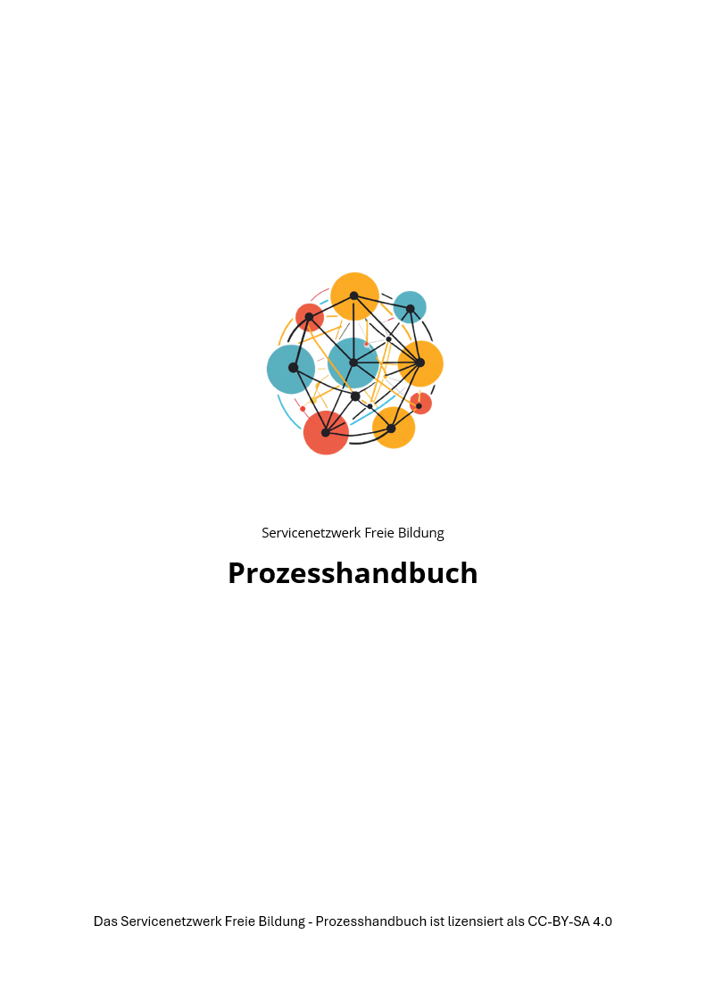
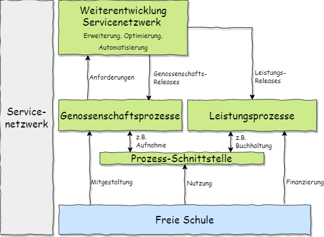

# Handbuch Servicenetzwerk Freie Bildung

Das Servicenetzwerk Freie Bildung konzipiert ein Genossenschaftsmodell, in dem freie Schulen genossenschaftlich die Verbesserung ihrer administrativen Abläfe organisieren. Das Konzept ist aufgrund der CC BY-SA 4.0 Lizenz offen verfügbar.

Dieses ebook stellt die vom Servicenetzwerk unterstützten Abläufe vor.

Momentan liegt der Fokus auf den Leistungsprozessen zur Finanzverwaltung, die für die teilnehmenden Schulen essenziell sind.

Weitere Leistungsprozesse sind in Planung.

Das Handbuch ist noch im Aufbau und wird sich in der Weiterentwicklung immer wieder ändern.

