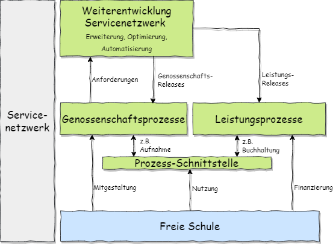

# Prozesshandbuch Servicenetzwerk

Dieses ebook stellt die vom Servicenetzwerk unterstützten Abläufe vor. Momentan liegt der Fokus auf den Buchhaltungsprozessen, die für die teilnehmenden Schulen essenziell sind.

Weitere Prozesse in Planung:

## Servicenetzwerk
* Aufnahme einer weiteren Schule
* Einführung neuer Leistungsangebote
* Training
* Informationskonzept

## IT
* Automatisierung von Abläufen
* Sicherheitsprozesse

## Schulen
* Kommunikationsprozesse
* Regulatorische Prozesse

