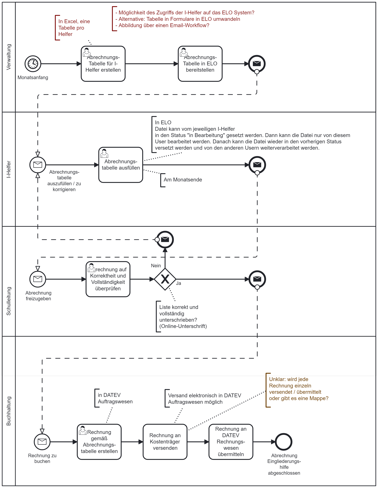

# Abrechnung von Eingliederungshilfen

## Beteiligte
* Integrationshelferin
* Schulleitung
* Verwaltung
* Buchhaltung

## Der ideale Prozess

### Ablauf

* Zu jedem Monatsanfang stellt die Verwaltung die Abrechnungstabelle für jede Integrationshelferin bereit.
* Zum Abrechnungsstichtag am Monatsende füllt jede Integrationshelferin die Abrechnungstabelle mit den geleisteten Arbeitsstunden aus. Wenn alle Einträge erfolgt sind, muss die Integrationshelferin die Tabelle zur Prüfung übergeben.
* Die Schulleitung erhält für jede zur Prüfung übergegebene Tabelle eine Benachrichtigung.
* Die Schulleitung stellt die Korrektheit und Vollständigkeit der Abrechnung fest. 
  * Sofern eine Abrechnung Fehler aufweist, geht sie zurück an die betroffene Integrationshelferin zur Klärung bzw. Korrektur. 
* Die Schulleitung gibt die Abrechnung zur Buchung bis zum Buchungsstichtag frei.
* Die Buchhaltung erstellt für jede zur Buchung freigegebene Abrechnung eine Rechnung an den Kostenträger und versendet diese spätestens am Versandstichtag.
* Die Buchhaltung übermittelt die Ausgangsrechnung an das DATEV-Rechnungswesen. Damit endet der Abrechnungsprozess der Eingliederungshilfe.

### Regelungen

* Abrechnungsstichtag: der 1. des Folgemonats, ersatzweise der vorangehende letzte Arbeitstag.
* Buchungsstichtag: der 10. des Folgemonats, ersatzweise der vorangehende letzte Arbeitstag.
* Versandstichtag: der 15. des Folgemonats, ersatzweise der vorangehende letzte Arbeitstag.
* Das Servicenetzwerk erstellt Kennzahlen zur Fristeneinhaltung und zur Prozesshistorie.
* Die Buchhaltungsregeln für die Ausgangsrechnungsbuchung.

### Voraussetzungen

* Kostenträger pro Integrationshelfer bekannt
* Integrationshelfer haben Zugriff auf Erfassungssoftware (ELO oder anderes Formular)
* Die Prozessteilnehmer agieren in einer Rolle und haben jeweils Vertreter, die die Augaben fristgerecht übernehmen können.

### Prozessfehler

* Stichtage überschritten: Der Teilnehmer und die Verwaltung erhalten eine Benachrichtigung mit der Bitte um dringende Erledigung. Bei Überschreitung der Buchungsstichtage Abrechnung im Folgemonat.
* Fehlzustellungen an Prozessteilnehmer: Nach Rücklauf und Datenkorrektur erneutes Ausführen der fehlerhaften Schritte.
* Fehlerhaft gestellte Ausgangsrechnung: buchhalterische Auflösung / Korrektur ohne erneuten Prozessdurchlauf.
* Fehlerhaft durchgeführte DATEV-Buchung: buchhalterische Auflösung / Korrektur ohne erneuten Prozessdurchlauf.

### Prozesskennzahlen

* Anzahl der Abrechnungen
* Prozessdurchlaufzeit
* Prozesskosten
* Einhaltungsquote des Abrechnungsstichtags
* Einhaltungsquote des Buchungsstichtags 
* Einhaltungsquote des Versandstichtags 
* Quote fehlerhafter Rechnungsstellungen
* Quote Fehlbuchungen

### Prozessartefakte

* Abrechnungstabelle
* Freigabe der Schulleitung
* Rechnungsbeleg für den Kostenträger
* DATEV-Buchungssatz

### Prozessablauf

