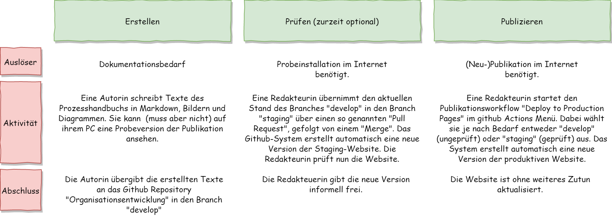
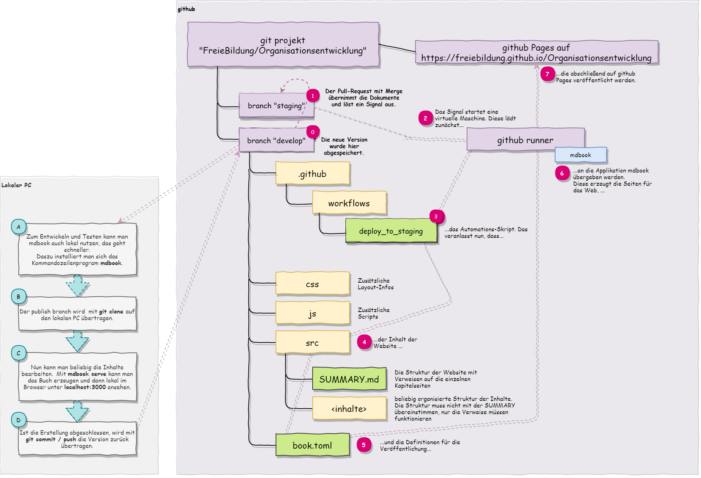

# Publikation

## Website

Das Handbuch zur Organisationsentwicklung wird weitgehend automatisch publiziert. Dazu dient die versionierte Ablage aller Inhalte im github Projekt-Repository. Zum Schreiben und schnellen Testen kann die Erzeugung auch lokal auf dem PC durchgeführt werden.

## Beteiligte
* Autorin
* Redakteurin

## Der ideale Prozess

### Ablauf

* Autoren schreiben in Markdown und speichern im github-Repository **Organisationsentwicklung** in den Branch *develop*. Sie können lokal ihre Änderungen testen, wenn ihr System dafür eingerichtet ist.

* Eine Redakteurin kann durch einen Pull-Request die letzten Änderungen von *develop* nach *staging* übernehmen (dies erfolgt über diese [Github-Seite](https://github.com/FreieBildung/Organisationsentwicklung/compare/staging...develop). Dieser Pull-Request löst eine Publikation auf die Pages des Repositories aus, so dass nun alle erstellten Änderungen auch auf einer Testseite im Internet zu sehen sind. Die Seite steht im Anschluss unter [https://freiebildung.github.io/Organisationsentwicklung/](https://freiebildung.github.io/Organisationsentwicklung/) zur Verfügung. Dieser Schritt ist optional und wird vor allem bei größeren Änderungen ohne lokale Vorprüfung empfohlen

* Die verantwortliche Redakteurin kann die Seite auf die offizielle Website übernehmen. Dies erfolgt zurzeit über den manuellen Start des Produktionsworkflows "Run Workflow" [auf dieser Seite](https://github.com/FreieBildung/Organisationsentwicklung/actions/workflows/deploy_pages.yml). Dabei kann der Workflow vom Branch "develop" (ungeprüft) oder "staging" (geprüft) die Daten lesen. Das System publiziert nun automatisch nach [https://www.servicenetzwerk-freie-bildung.de](https://www.servicenetzwerk-freie-bildung.de).

### Regelungen

* Abrechnungsstichtag: der 1. des Folgemonats, ersatzweise der vorangehende letzte Arbeitstag.
* Buchungsstichtag: der 10. des Folgemonats, ersatzweise der vorangehende letzte Arbeitstag.
* Versandstichtag: der 15. des Folgemonats, ersatzweise der vorangehende letzte Arbeitstag.
* Das Servicenetzwerk erstellt Kennzahlen zur Fristeneinhaltung und zur Prozesshistorie.
* Die Buchhaltungsregeln für die Ausgangsrechnungsbuchung.

### Voraussetzungen

* Kostenträger pro Integrationshelfer bekannt
* Integrationshelfer haben Zugriff auf Erfassungssoftware (ELO oder anderes Formular)
* Die Prozessteilnehmer agieren in einer Rolle und haben jeweils Vertreter, die die Augaben fristgerecht übernehmen können.

### Prozessfehler

Prozessfehler führen zu einem gescheiterten Workflow oder einem unerwünschten Ergebnis auf der Website.
Die Prozessfehler können auf der [Github-Seite zu Actions](https://github.com/FreieBildung/Organisationsentwicklung/actions) gesehen und untersucht werden. Der häufigste Fehler liegt in ungültigen Verweisen ausgehend von der SUMMARY.md Datei.

### Prozesskennzahlen

* Anzahl der Prüfungen
* Anzahl der Produktionsdeployments
* Prozessdurchlaufzeit
* Prozesskosten
* Fehlerquote der Produktionsdeployments

### Prozessartefakte

* Versionierte Dokumentation
* Publizierte Staging-Website
* Publizierte Produktions-Website

### Prozessablauf

#### Übersicht über den Publikationsprozess

#### Technischer Ablauf im Detail

