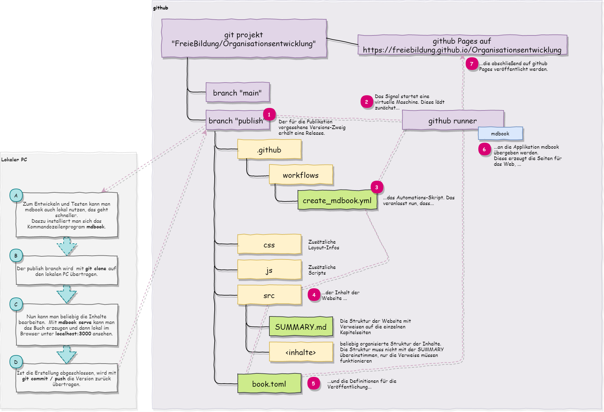

# Publikation

## Website

Das Handbuch zur Organisationsentwicklung wird weitgehend automatisch publiziert. Dazu dient die versionierte Ablage aller Inhalte im github Projekt-Repository. Sobald eine neue Version hinzugefügt wird, startet automatisch der Publikationsprozess und nach wenigen Minuten ist die neue Seite im Web unter [https://freiebildung.github.io/Organisationsentwicklung](https://freiebildung.github.io/Organisationsentwicklung) verfügbar. 

Zum Schreiben und schnellen Testen kann die Erzeugung auch lokal auf dem PC durchgeführt werden.

## Lebenszyklus-Prozess der Dokumentation

### Schreiben

Autoren schreiben im github-Repository **Organisationsentwicklung** in den Branch *develop*. Sie können  lokal ihre Änderungen testen.

### Prüfen

Ein Redakteur kann durch einen Pull-Request die letzten Änderungen von *develop* nach *staging* übernehmen. Dieser Pull-Request löst eine Publikation auf die Pages des Repositories aus, so dass nun alle erstellten Änderungen auch auf einer Testseite im Internet zu sehen sind. Die Seite steht im Anschluss unter [https://freiebildung.github.io/Organisationsentwicklung/](https://freiebildung.github.io/Organisationsentwicklung/) zur Verfügung.

### Freigeben

Wenn die Änderungen auf der Testseite zufriedenstellend sind, kann der verantwortliche Redakteur die Seite auf die offizielle Website übernehmen. Dies erfolgt mit...
