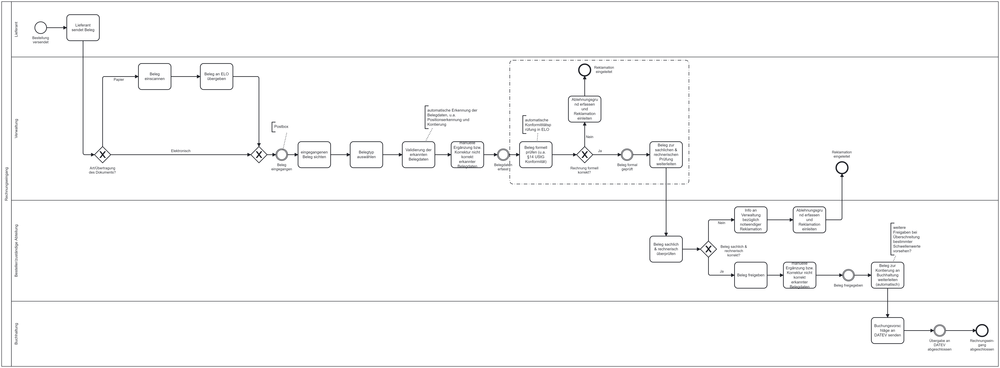

# Belegeingang

## Beteiligte
* Lieferant
* Verwaltung
* Besteller - zuständige Abteilung
* Buchhaltung

## Der ideale Prozess

### Ablauf
* Die Verwaltung Schule erhält eine Rechnung.
* Die Verwaltung digitalisiert die Rechnung, wenn sie als Papier ankommt.
* Die Verwaltung lädt den digitalen Beleg ins Dokumentenmanagement der Buchhaltung.
* Die Verwaltung dokumentiert den Verwendungszweck des Belegs im Dokumentenmanagement.
* Die Verwaltung prüft den Beleg nach UStG §14 (z.B. Adressat, Datum, Umsatzsteuer etc.).
  * Sofern die Rechnung fehlerhaft ist, fordert die Verwaltung eine Rechnungskorrektur an.
* Der Besteller prüft die Rechnung auf sachliche und rechnerische Richtigkeit.
  * Sofern die Rechnung fehlerhaft ist, übergibt der Besteller sie mit Gründen zurück an die Verwaltung. Die Verwaltung fordert eine Korrektur an.
* Die Besteller gibt die Rechnung frei.
  * Bei Überschreitung eines Freigabebetrages prüft ein Vorgesetzter die Rechnung ebenfalls.
* Die Buchhaltung bucht den Beleg kreditorisch.

### Schnittstellen

### Regelungen

### Voraussetzungen

### Prozessfehler

### Prozesskennzahlen
* Wie viele Rechnungen werden angemahnt?
* Wie viel Skontoverlust wegen verspäteter Zahlung ist entstanden?
* Wie viele Rechnungen müssen storniert werden wegen Fehlbuchungen?
* Wie viele Rechnungen werden insgesamt gebucht?
* Wie lange ist die durchschnittliche Durchlaufzeit pro Rechnung? 

## Prozessablauf

